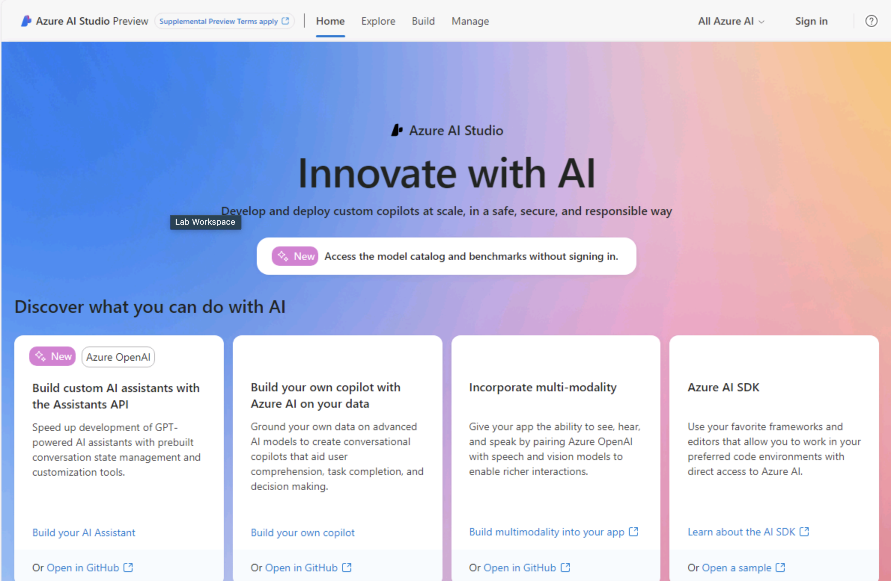
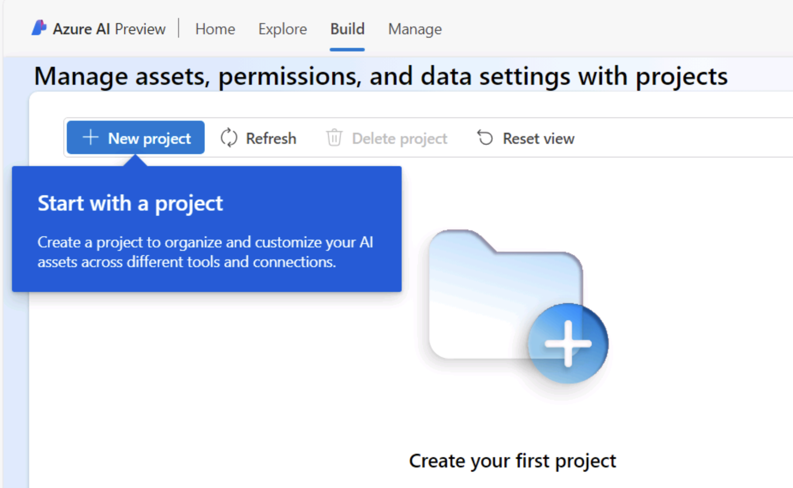
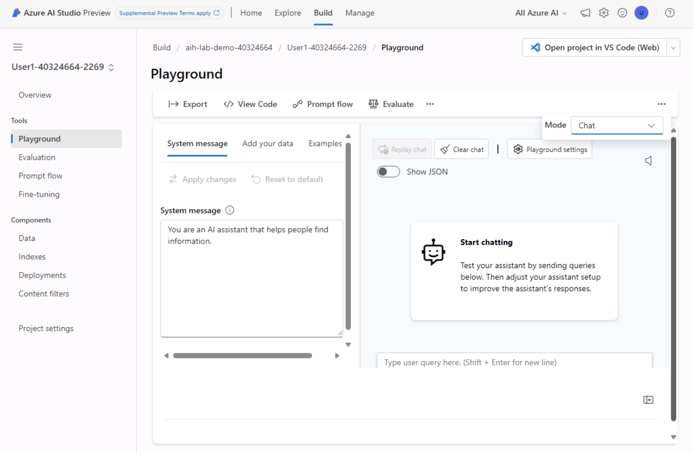
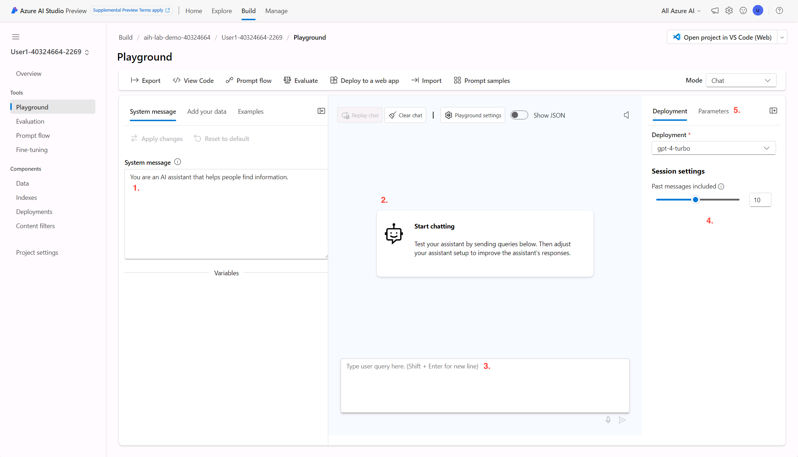
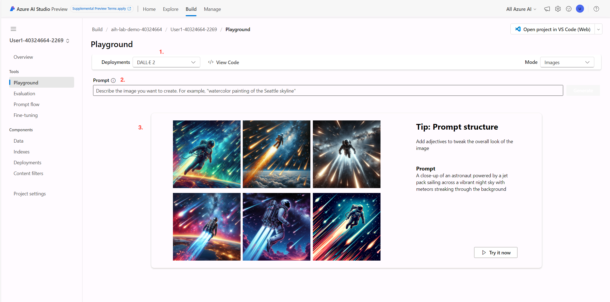

# Get started

> [!TIP]
> What is Azure AI Studio? Azure AI Studio is a cloud-based service that makes it easy for developers of all skills levels to build AI applications. It provides a single place to do everything you need to build an AI application, including loading data, preparing it for training, training a model and deploying the model to production.

For this workshop we will be working on Azure AI Studio, especially focusing on the playground feature. We can access AI Studio by opening the browser and visiting https://ai.azure.com

## Navigating AI Studio

Let's start by clicking on **Sign In** and entering the provided Microsoft account and the provided password. For this you can simply click on the Green **T** logo. The environment will fill it in for you.

Now that we are logged in, we can start navigating the platform. Let's start with the **Explore** tab.

### Explore Tab

In this tab you will find the following fields:

- **Model Catalog**: The model catalog showcases the available models inside AI Studio. You can click and expand on each model for in-depth description of usage and other details.

> [!NOTE]
> Azure AI Studio hosts some of the most popular large language and vision foundation models, curated by Microsoft, Hugging Face, Meta and Mistral.

- **Model Benchmarks**: Here you can compare benchmarks across models and datasets available, with charts on accuracy, similarity, fluency, coherence, etc.
- **Prompt Catalog**: The prompt catalog provides sample prompts for a myriad of common use cases, which can be used to further understand how a model works, and can be customized for specific scenarios.

### Build Tab

This tab allows us to manage our assets, permissions, deployments and data settings through the use of **Projects**. A project in AI Studio grants us access to most of the platform's features, such as the **Playground**.

#### Creating our Project 
For this lab, we will need to create a project. This can be done as follows:

1. Click on the **+ New Project** button.
1. On the pop up window, feel free to name your project to your liking, and under the **Hub** field select the already created hub: 
1. Click on **Create Project**
1. Once the project finishes creating, you will be taken to the project's overview page. Here we can access all the major details of the projects, such as endpoints, quotas and more. We will revisit this later on.

For now, we will move on to the Manage Tab.

### Manage Tab

The **Manage** tab allows us to view and edit our hubs inside Azure AI Studio. For this lab, there is a Hub already created, named *Lab 301 AI Hub*. If we click on it we will be able to see the details of the hub, such as the Azure services that connect to it, the resources it uses and the projects it hosts.

Feel free to explore this details, but we will not be needing to carry out any changes for the lab.

## Azure AI Studio's Playground

We will now move to the Playground, where most of our work will be carried out.
1. Navigate back to the **Build** tab
3. On the left panel, click on **Playground**.

The Playground has different elements we will be interacting with, and as such it will be useful to get familiar with them.

The most important element to look at is the Playground's **Mode**. This dictates what type of activity and deployment we will be carrying out. For our lab we will only focus on *Chat* and *Images*.

> [!NOTE]
> There is also playground modes designed for various type of scenarios, such as Assistants, Completions and others.

### Chat Mode

1. **System Message Box**: Here is where we enter instructions for the model, previous to the user interaction.
1. **Chat Box**: The chat box is where we will see our interactions with the model in the form of chat messages.
1. **Prompt Box**: This is where we type the prompts we want to send to the model.
1. **Deployment and deployment settings**: This section allows us to change between our deployed models, and set settings around it such as the message history.
1. **Parameters**: This tab contains the models detailed settings, such as temperature.

### Images Mode

1. **Deployments**: In this drop-down we are able to choose the model to prompt for image generation. These models, just like the chat ones, come from our deployments.
1. **Prompt Box**: Similar to the chat mode box, this is where the models get their input from the user. In the case of images, descriptions of what we want to generate.
1. **Results Box**: Finally, here is where the generated images are displayed.

## Ready to start

That covers the necessary setup and basics of Azure AI Studio. We will now move forward to begin interacting with the models. Ensure you are back to the **Chat** mode in the Playground, and go to the next section.
